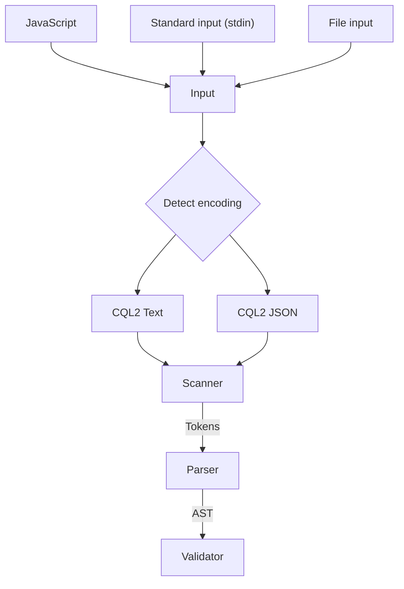

# Open Geospatial Consortium (GCQ) Common Query Language (CQL2) filter tooling

A browser-oriented implementation of OGC CQL2 filters in TypeScript

### Links:
- https://www.ogc.org/standard/cql2/
- https://docs.ogc.org/is/21-065r2/21-065r2.html
- https://schemas.opengis.net/cql2/1.0/cql2.bnf
- https://schemas.opengis.net/cql2/1.0/cql2.json
- https://schemas.opengis.net/cql2/1.0/examples/ (will be useful for tests)

---

## Theoretical high level design

