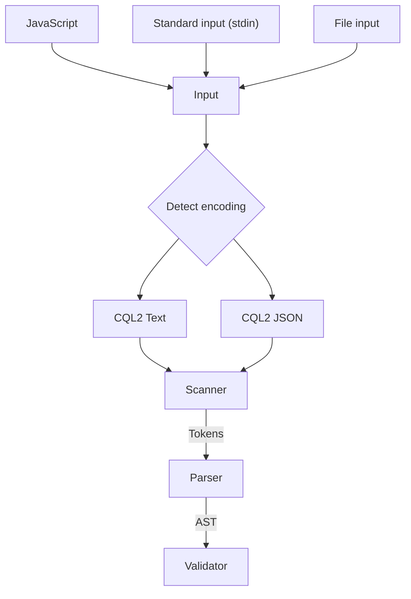

# Open Geospatial Consortium (GCQ) Common Query Language (CQL2) filter tooling

A browser-oriented implementation of OGC CQL2 filters in TypeScript

---

## Theoretical high level design

```mermaid
flowchart TD
    JS[JavaScript] --> IN[Input]
    SI["Standard input (stdin)"] --> IN[Input]
    FI[File input] --> IN[Input]
    IN --> D{Detect encoding}
    D --> CT[CQL2 Text]
    D --> CJ[CQL2 JSON]
    CT --> SC[Scanner]
    CJ --> SC[Scanner]
    SC --> |Tokens| PR[Parser]
    PR --> |AST| V[Validator]

```

