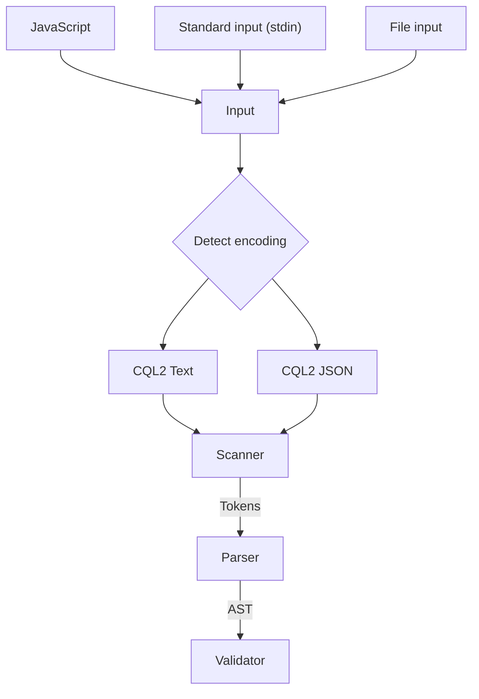

# Open Geospatial Consortium (GCQ) Common Query Language (CQL2) filter tooling

A browser-oriented implementation of OGC CQL2 filters in TypeScript. The goal of this tool is to enable Javascript based application (Web apps, Node.js, etc) to search STAC catalogs.

## Links

- [Common Query Language (CQL2) Standard page](https://www.ogc.org/standard/cql2/)
- [The standard itself](http://www.opengis.net/doc/IS/cql2/1.0)
- [BNF](https://schemas.opengis.net/cql2/1.0/cql2.bnf)
- [JSON Schema](https://schemas.opengis.net/cql2/1.0/cql2.json)
- [Examples](https://schemas.opengis.net/cql2/1.0/examples/) - Folder with Text and JSON examples.

---

## Theoretical high level design

