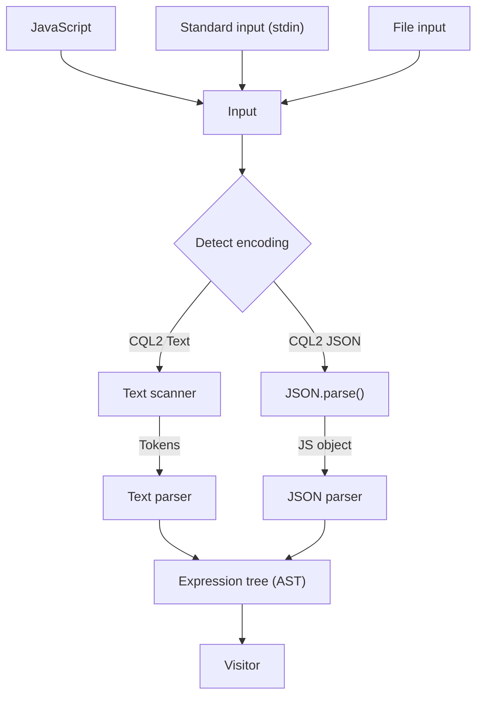

# Open Geospatial Consortium (OGC) Common Query Language (CQL2) filter tooling

A browser-oriented implementation of OGC CQL2 filters in TypeScript. The goal of this tool is to enable Javascript based application (Web apps, Node.js, etc) to search STAC catalogs.

[OGC CQL2 Filters playground](https://noamra.github.io/ogc-cql2-filters/). Sourcemaps are available, feel free to look under the hood.

## Links

- [Common Query Language (CQL2) Standard page](https://www.ogc.org/standard/cql2/)
- [The standard itself](https://www.opengis.net/doc/IS/cql2/1.0)
- [BNF](https://schemas.opengis.net/cql2/1.0/cql2.bnf)
- [JSON Schema](https://schemas.opengis.net/cql2/1.0/cql2.json)
- [Examples](https://schemas.opengis.net/cql2/1.0/examples/) - Folder with Text and JSON examples.

---

## High level design

## Usage

Both CQL2 Text and JSON encodings are supported. Parsing functions return an expression in tree structure. Expressions have `toText` and `toJSON` methods, which produce encoding in string or object respectively.

- `parseText(string)` parses CQL2 Text
- `parseJSON(object)` parses CQL2 JSON
- `run(input)` wraps parsing functions + simple heuristic

### Visitor

Expression tree also has `accept(visitor, context)` method that receive a visitor object as input. The visitor object should implement all visit functions. This enable producing output when traversing the expression tree. The optional context parameter enabled passing additional information for the visitor, such as current path to the expression.
For concrete Visitor examples, see `Expression.test.ts` suite, or ReactVisitor for a more advanced implementation.

### Dependencies

The parsers runtime are dependency free. I'd like to publish the parsers as a separate module, but ATM that's not the case. In development there are multiple dependencies, but trying to keep them to minimum.

Playground is built with React.

## Development

PR welcome

### First time only

- Clone the repository
- Install dependencies `npm install`

### Parsers development

Test driven development is advised, using `npm run test`. Vitest is the test runner.

### Playground development

The Playground is powered by Vite and React. Run `npm run dev` to start dev server. For real experience use `npm run build && npm run preview`.

### Checking everything

In no particular order:

- Make sure you created a new branch, and commit changes
- Run all checks (lint, type check, tests) - `npm run checks`.
- ESlint + Prettier - `npm run lint`.
- TypeScript type check - `npm run type-check`.
- Tests - `npm run tests` for continues running test suite on fule change, or run just once using `npm run tests:once`.
- Code coverage - `npm run test:coverage` - coverage is not enforced, but for parsers I try to have close to 100%. Exceptions are edge cases, which should throw.
- Increment version - Each PR must increment version properly using `npm version <major | minor | patch>`. The CI test (`npm run test:ci`) enforces that.

When done, push branch and create PR. Github Actions will run checks
