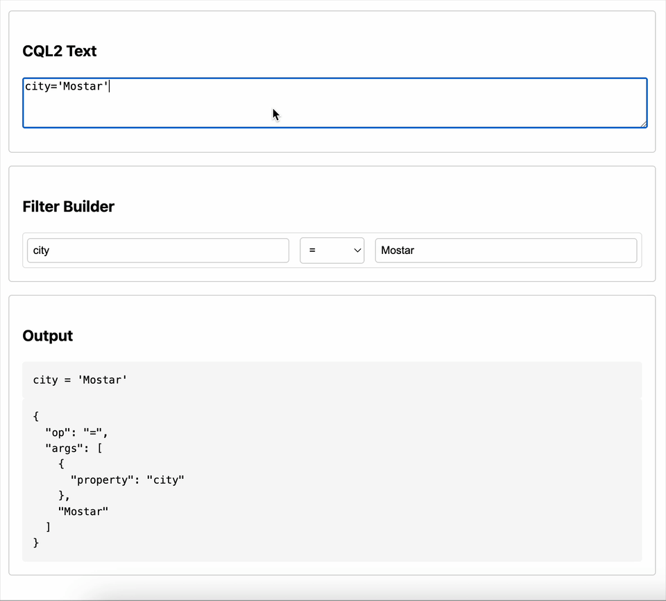

# CQL2 Filter Builder Minimal HTML Demo

This is a minimal, non-production demo of a CQL2 filter builder and parser in plain HTML and JavaScript.
The core of the demo is the `BuilderVisitor` object, which can be found at [the beginning of `main.js` file](./main.js).

## What it does

- Lets you type a [CQL2](https://www.ogc.org/standard/cql2/) filter expression in the left panel.
- Parses the expression and displays a simple interactive builder view in the middle panel.
- Shows the parsed filter as CQL2 text and as JSON in the right panel.

## How to run

1. Open `index.html` in your browser. No build step or server is required.
2. Type a CQL2 filter (e.g., `city='Mostar'`) in the text area.
3. The builder and outputs update automatically.

## Notes & Limitations

- This is **example code only** and not suitable for production use.
- Only basic string/numeric literals, properties, and binary expressions are supported.
- Uses the [cql2-filters-parser](https://www.npmjs.com/package/cql2-filters-parser) via CDN.
- No state sync between the builder and text area (one-way: text → builder).
- No advanced features, validation, or error handling.
